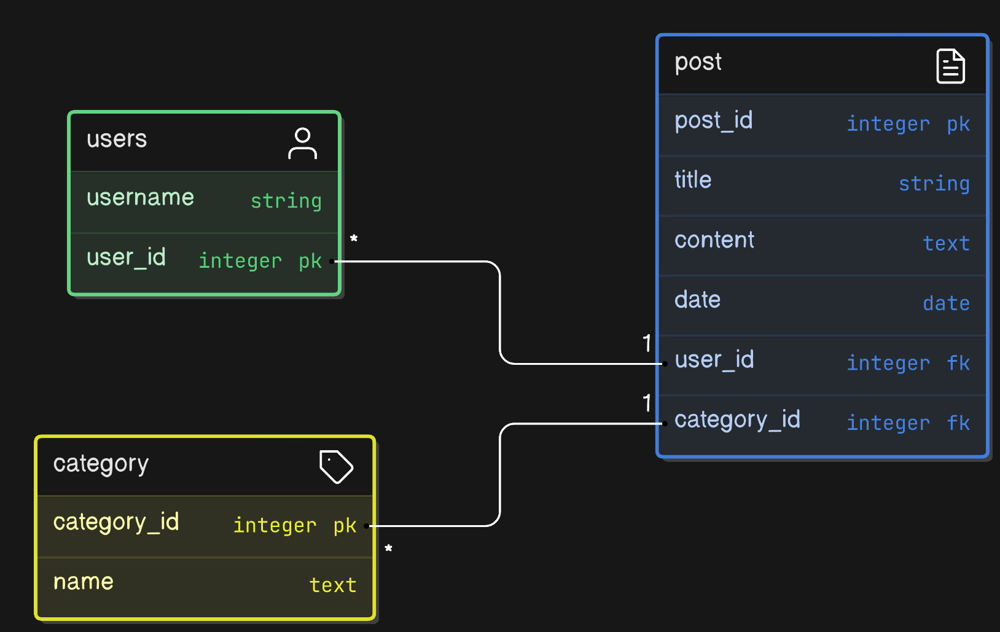

# BlogCreater

#### Date 13/6/2024

#### By *Mohamed Ahmed Mohamed*

## Description
BlogCreater is a tool that allows users to create and manage blogs. Users can create posts and categories. This project showcases the use of SQLAlchemy for database management.

## Project Setup
To set up the project, follow the installation instructions below.

## Installation

## Installation Requirements
- Python 3.8
- SQLAlchemy
- Art package for generating ASCII art
- Necessary database setup

### Installation Instructions
1. Clone the repository:
    ```sh
    git clone https://github.com/study-repo-org/BlogCreater
    ```
2. Navigate to the project directory:
    ```sh
    cd BlogCreater
    ```

## Entity-Relationship Diagram (ERD)
The following diagram shows the relationships between the tables in the BlogCreater database:




## Technologies Used
- Python
- SQLAlchemy
- Art package

## Support and Contact Details
For support and contact, visit: [GitHub](https://github.com/study-repo-org)

### Author
[Mohamed Ahmed](https://github.com/study-repo-org)

### License
[MIT License](LICENSE)
The content of this site is licensed under the MIT license.
Copyright (c) 2024.
